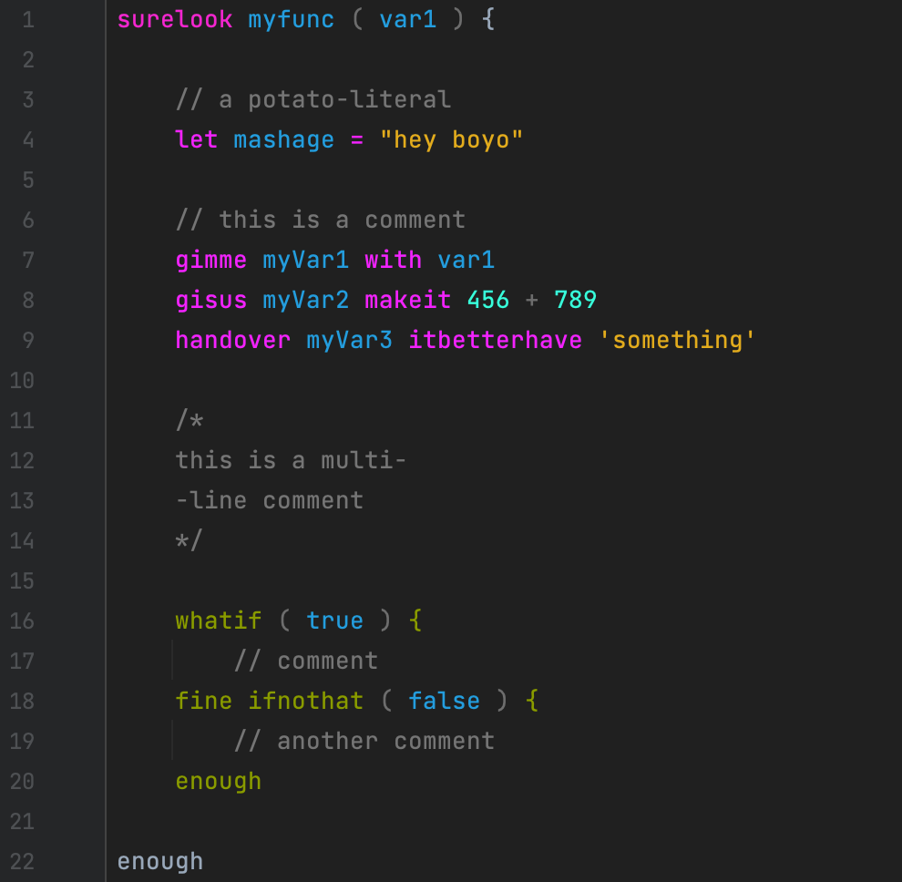

# Introduction

This repo isn't anything special, don't expect to find anything useful here.

I am playing around with 'Parser Expression Language' to parse programming files, and putting those experiments here.

## Example

No doubt you've asked yourself the question "what if there was an Irish slang programming language syntax? what would it look like", well slacken your jaw and stop asking questions because here you go, something nobody ever wanted or needed, I present to you CulchieScript:

